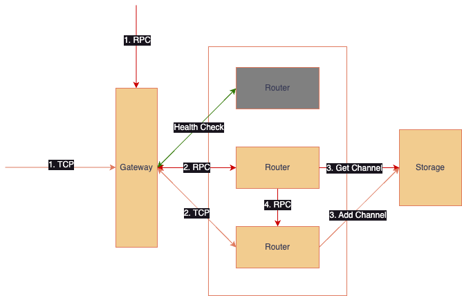
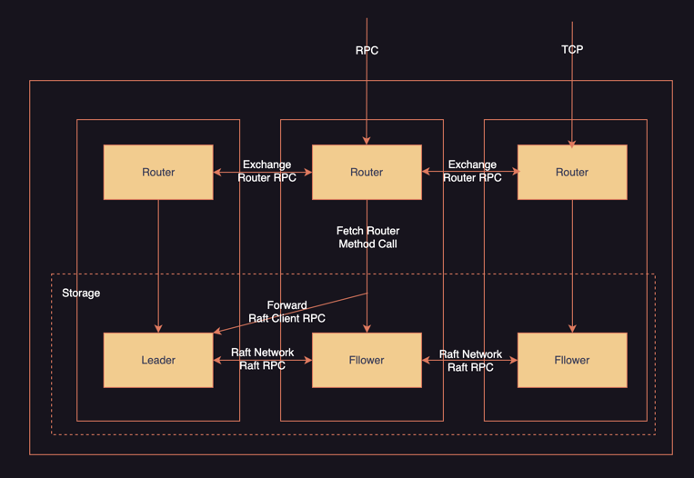

# iot-server-template
An iot server that bridge between the private tcp protocol device and egccri.

_[WIP] Distributed version use openraft._

#### How it worked.


#### Cluster arch.



#### Raft storage

Raft storage is an optional embedded distribute storage for the cluster router component, and it based on openraft. 
 
The other way is redis.

#### RPC calls



#### Quick start

```shell
cargo build
./target/debug/iot-server-template -c ./config/config.toml
```
